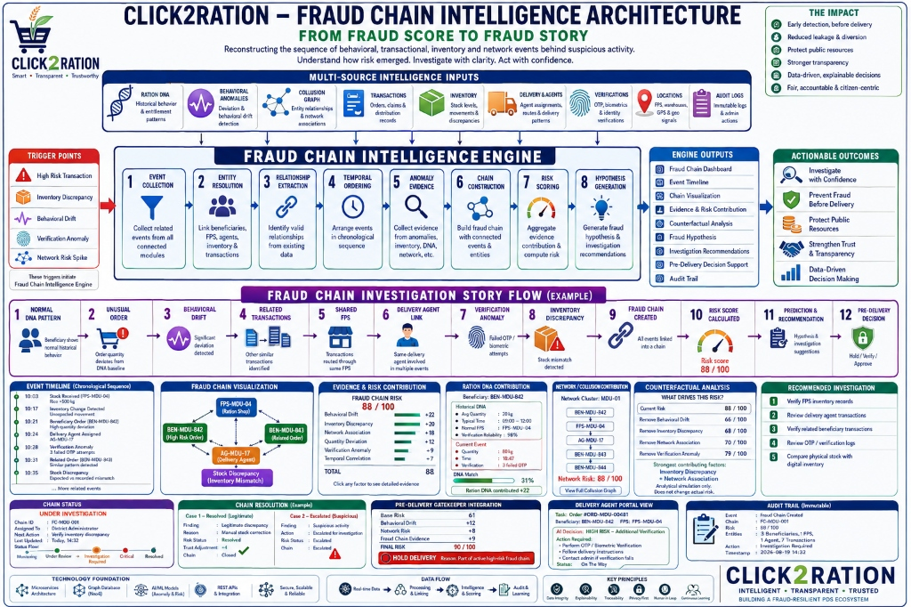

<div align="center">

# Click2Ration (C2R) - National PDS Admin Control Center

**Next-Generation Public Distribution System Management, AI-Driven Fraud Chain Intelligence, and Permissioned Blockchain Audit Infrastructure**

<br />



<br />

</div>

---

## Executive Summary

Click2Ration (C2R) is an enterprise-grade administrative, intelligence, and monitoring platform built to modernize the Public Distribution System (PDS). By integrating real-time logistics telemetry, role-based administrative workflows, multi-tiered AI anomaly detection, and a cryptographically verifiable permissioned blockchain ledger, Click2Ration eliminates leakages, prevents stock diversions, and ensures essential commodities reach designated beneficiaries with complete transparency.

---

## Flagship Innovation: AI-Powered Fraud Chain Intelligence

Click2Ration introduces a PDS-specific **Fraud Chain Intelligence** layer that moves beyond isolated fraud scores by reconstructing the sequence of behavioral, transactional, inventory, verification, and network events associated with suspicious activity.

### Core Philosophy: From Fraud Score to Fraud Story

```
+----------------------------------------------------------------------------------------------------+
|                             CLICK2RATION FRAUD CHAIN INTELLIGENCE ENGINE                           |
|                                                                                                    |
|  [MULTI-SOURCE INTELLIGENCE INPUTS]                                                                |
|  * Ration DNA (Historical baseline)           * Inventory (Discrepancies & movements)              |
|  * Behavioral Drift (Quantity & timing)       * Delivery & Agents (Carrier anomalies)              |
|  * Collusion Graph (Network clusters)         * Verifications (OTP / Biometric retries)            |
|                                                                                                    |
|                                                |                                                   |
|                                                v                                                   |
|  [8-STAGE ENGINE PIPELINE]                                                                         |
|   1. Event Collection    -> 2. Entity Resolution     -> 3. Relationship Extraction                 |
|   4. Temporal Ordering   -> 5. Anomaly Evidence      -> 6. Chain Construction                      |
|   7. Risk Scoring        -> 8. Hypothesis Generation                                               |
|                                                                                                    |
|                                                |                                                   |
|                                                v                                                   |
|  [EXPLAINABLE RISK & ACTIONABLE OUTCOMES]                                                          |
|  * Fraud Chain Dashboard & Sequence Flow      * What Drives This Risk? (Counterfactual Tool)       |
|  * Chronological Event Timeline               * Evidence-Driven Investigation Recommendations      |
|  * Mathematical Feature Contributions         * Pre-Delivery Gatekeeper (Automated Dispatch Hold)  |
|  * Controlled Chain Resolution                * Immutable Audit Logging                            |
+----------------------------------------------------------------------------------------------------+
```

---

## Key Pillars and System Capabilities

### 1. Fraud Chain Intelligence & Story Reconstruction
- **Chronological Event Timeline:** Reconstructs the exact sequence of events (Stock Inflow -> Inventory Drift -> Beneficiary Order -> Agent Assignment -> OTP Failures -> Correlated Orders -> Pre-Delivery Hold).
- **Explainable Evidence Contributions:** Transparent mathematical weighting (`+22 pts` Behavioral Drift, `+20 pts` Inventory Discrepancy, `+18 pts` Network Association, `+12 pts` Quantity Surge, `+9 pts` Verification Anomaly, `+7 pts` Temporal Correlation).
- **"What Drives This Risk?" Counterfactual Simulator:** Allows administrators to analytically simulate the removal of individual evidence factors without altering database records to identify primary drivers.
- **Evidence-Driven Recommendations:** Prioritizes investigative tasks based on observed triggers (e.g., physical stock verification, carrier route review, in-person biometric check).
- **Pre-Delivery Gatekeeper Integration:** Automatically places consignments on administrative hold if linked to active high-risk fraud chains.

### 2. Ration DNA & Behavioral Drift Anomaly Detection
- **Ration DNA Baseline Profiling:** Models typical family consumption tiers, ordering hour windows, preferred FPS outlets, and authentication success reliability.
- **Graceful Handling of Insufficient History:** New or migrant ration cards with fewer than 3 transactions are placed on probationary baseline with explicit labels rather than fabricated anomaly scores.
- **Multi-Signal Drift Vectors:** Evaluates volume spikes, off-peak timing, shop divergence, consecutive OTP retries, and velocity anomalies.

### 3. Collusion Graph & Network Clustering
- **Graph Entity Model:** Maps relationships across Beneficiaries, Ration Cards, FPS Hubs, Delivery Agents, Districts, Transactions, and Verification Terminals.
- **Cluster Identification:** Detects high-risk co-occurrence rings where multiple anomalous beneficiaries converge through the same shop and carrier.

### 4. Cryptographic Blockchain Audit Ledger
- **SHA-256 Hash Chaining:** Every grain movement, stock transfer, and allocation change is committed to an immutable ledger where each block contains the cryptographic signature and hash of the preceding block.
- **Independent Verification:** Automated mathematical chain verification detects any database-level tampering or retroactively modified entries instantly.
- **Privacy-Preserving Architecture:** Sensitive citizen identifiers (Aadhaar, mobile numbers) are never stored on the ledger.
- **Exportable Audit Certifications:** Generates cryptographically validated PDF audit reports formatted for regulatory oversight.

### 5. Multi-Tiered Role-Based Access Control (RBAC)
- **Super Administrator:** National-level monitoring, statewide fraud chain dossiers, blockchain integrity control, district allocation controls, and system configuration.
- **District Administrator:** Scoped strictly to assigned district jurisdictions for fraud chain analysis and inventory reconciliation.
- **Fair Price Shop (FPS) Administrator:** Local stock receipt acknowledgement, biometric/OTP ration distribution, and localized quota balance tracking.
- **Delivery Personnel:** Real-time consignment status, dispatch logging, route progress, and proof-of-delivery timestamps.

---

## Technology Stack

### Frontend Application
- **Core Framework:** React 18 with TypeScript
- **Build Tool:** Vite
- **UI Architecture:** Tailwind CSS, Radix UI primitives, shadcn/ui component library
- **Motion & Interactions:** Framer Motion
- **Visualizations & Telemetry:** SVG Graph Engine, Recharts, Lucide React
- **Routing:** HashRouter (100% SPA compatibility across all static hosts)
- **Document Generation:** jsPDF, jsPDF-AutoTable
- **State & Query Management:** TanStack React Query

### Backend Infrastructure
- **Runtime Environment:** Node.js 18+ / TypeScript
- **API Framework:** Express.js
- **Database:** PostgreSQL (with indexed JSONB block storage)
- **Security & Cryptography:** Helmet, SHA-256 hash digests, HMAC digital signatures
- **Database Client:** pg (node-postgres with connection pooling)

---

## Directory Structure

```
admin-click2ration/
|-- backend/                       # Permissioned blockchain & fraud intelligence service
|   |-- src/
|   |   |-- controllers/           # API request controllers
|   |   |-- db/                    # Connection pooling, migrations, seeds
|   |   |-- routes/                # REST endpoints (/blockchain, /fraud, /health)
|   |   |-- services/              # SHA-256 chain logic & fraud scoring service
|   |   |-- types/                 # Backend TypeScript interfaces
|   |   `-- server.ts              # Express initialization
|   |-- package.json
|   `-- tsconfig.json
|-- docs/                          # Documentation assets and architecture diagrams
|   `-- fraud_chain_architecture.jpg # Flagship Fraud Chain Intelligence architecture
|-- public/                        # Static assets & SPA redirects (_redirects)
|-- src/
|   |-- components/
|   |   |-- fraud/                 # Fraud Chain timeline, graph flow, counterfactual simulator, resolve modal
|   |   `-- layout/                # Role sidebar, dashboard headers, navigation
|   |-- contexts/                  # AuthContext, LanguageContext, ThemeContext
|   |-- pages/                     # Application pages
|   |   |-- FraudChainPage.tsx     # Flagship Fraud Chain Intelligence command center
|   |   |-- FraudPage.tsx          # Multi-tier AI fraud intelligence center
|   |   |-- BlockchainAuditDashboard.tsx
|   |   |-- BlockchainExplorerPage.tsx
|   |   |-- DashboardPage.tsx
|   |   |-- DistrictAdminDashboard.tsx
|   |   |-- OrdersPage.tsx
|   |   |-- InventoryPage.tsx
|   |   `-- ShopDeliveryManagement.tsx
|   |-- services/
|   |   `-- fraudEngine/           # Fraud chain, Ration DNA, drift, collusion, risk engine
|   |-- test/                      # Unit test suites (vitest)
|   |-- App.tsx                    # Route definitions & HashRouter wrapper
|   `-- main.tsx                   # Client entry point
|-- netlify.toml                   # Netlify deployment configuration
|-- package.json
|-- tailwind.config.ts
|-- tsconfig.json
`-- vite.config.ts
```

---

## Getting Started

### Prerequisites
- Node.js (v18.0.0 or higher)
- npm or bun
- PostgreSQL (v14.0 or higher - optional for backend persistence)

---

### Frontend Setup

1. **Install dependencies:**
   ```bash
   npm install
   ```

2. **Start the development server:**
   ```bash
   npm run dev
   ```

3. **Access the portal:**
   Open your browser at `http://localhost:8081`

4. **Production Build:**
   ```bash
   npm run build
   ```

---

### Backend Ledger & Intelligence Setup (Optional)

1. **Navigate to backend directory:**
   ```bash
   cd backend
   npm install
   ```

2. **Configure environment:**
   ```bash
   cp .env.example .env
   ```

3. **Run the Backend API:**
   ```bash
   npm run dev
   ```
   The backend service will listen on `http://localhost:3001`.

---

## API Reference

| Method | Endpoint | Description | Access Level |
| :--- | :--- | :--- | :--- |
| `GET` | `/fraud/chains` | Retrieve all active Fraud Chains (supports `?district=...`) | Authenticated |
| `GET` | `/fraud/chains/:chainId` | Fetch full fraud chain dossier, timeline, and hypothesis | Authenticated |
| `POST` | `/fraud/chains/:chainId/counterfactual` | Simulate counterfactual removal of evidence factors | Admin |
| `PATCH` | `/fraud/chains/:chainId/status` | Update chain investigation status with audit logging | Admin |
| `POST` | `/fraud/chains/:chainId/resolve` | Commit formal resolution with dynamic trust recovery | Admin |
| `POST` | `/fraud/pre-delivery-check` | Real-time multi-signal scoring against Ration DNA & chains | Authenticated |
| `GET` | `/fraud/ration-dna/:id` | Retrieve beneficiary historical baseline & trust score | Authenticated |
| `GET` | `/fraud/audit-trail` | Retrieve immutable administrative action ledger | Super / District Admin |
| `POST` | `/blockchain/stock-transfer` | Commit stock dispatch/receipt block to ledger | Authenticated |
| `GET` | `/blockchain/verify-chain` | Execute full cryptographic integrity check | Admin |

---

## Deployment & Live URLs

- **Live GitHub Pages URL:** [https://kishore-dev-21.github.io/C2R_AdminPortal/#/login](https://kishore-dev-21.github.io/C2R_AdminPortal/#/login)
- **Netlify Configuration:** Fully configured with `netlify.toml` and `public/_redirects` for 1-click deployments.

---

## License

This project is distributed under the MIT License.
