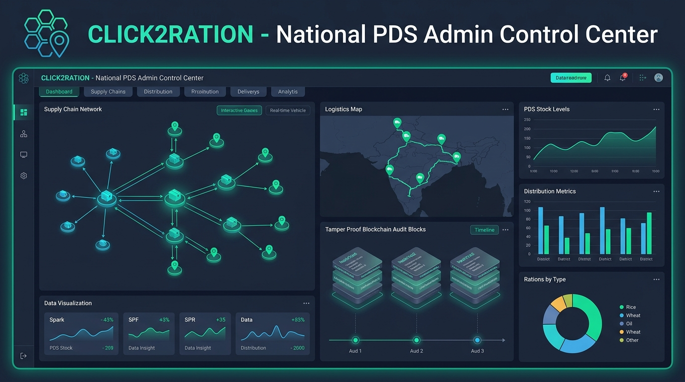

<div align="center">

# Click2Ration (C2R) - National PDS Admin Control Center

**Next-Generation Public Distribution System Management, AI-Driven Fraud Detection, and Permissioned Blockchain Audit Infrastructure**

<br />



<br />

</div>

---

## Executive Summary

Click2Ration (C2R) is an enterprise-grade administrative and monitoring platform built to modernize the Public Distribution System (PDS). By integrating real-time logistics telemetry, role-based administrative workflows, machine-learning anomaly detection, and a cryptographically verifiable permissioned blockchain ledger, Click2Ration eliminates leakages, prevents stock diversions, and ensures essential commodities reach designated beneficiaries with complete transparency.

---

## Key Pillars and System Capabilities

### 1. Cryptographic Blockchain Audit Ledger
- **SHA-256 Hash Chaining:** Every grain movement, stock transfer, and allocation change is committed to an immutable ledger where each block contains the cryptographic signature and hash of the preceding block.
- **Independent Verification:** Automated mathematical chain verification detects any database-level tampering or retroactively modified entries instantly.
- **Privacy-Preserving Architecture:** Strict separation ensures that sensitive citizen identifiers (e.g., Aadhaar, mobile numbers) are never stored on the ledger, keeping audit records lean and compliant with data privacy regulations.
- **Exportable Audit Certifications:** Generates cryptographically validated PDF audit reports formatted for government oversight and independent regulatory inspection.

### 2. Multi-Tiered Role-Based Access Control (RBAC)
- **Super Administrator:** National-level monitoring, system health checks, blockchain integrity control, district allocation controls, and system configuration.
- **District Administrator:** Regional warehouse management, sub-allocation to Fair Price Shops (FPS), and district-level inventory reconciliation.
- **Fair Price Shop (FPS) Administrator:** Local stock receipt acknowledgement, biometric/OTP ration distribution, and localized quota balance tracking.
- **Delivery and Logistics Personnel:** Real-time consignment status, dispatch logging, route progress, and proof-of-delivery timestamps.

### 3. AI-Powered Anomaly & Fraud Detection Engine
- **Diversion Detection:** Correlates dispatched warehouse quantities with shop-received metrics to identify en-route stock diversions.
- **Ghost Beneficiary Identification:** Analyzes collection velocity and demographic variance to uncover phantom allocations.
- **Stock Mismatch Alerts:** Flags discrepancies between physical sensor telemetry, database states, and immutable blockchain blocks.
- **Risk Scoring:** Assigns real-time risk scores to shops, routes, and districts to prioritize regulatory inspections.

### 4. End-to-End Supply Chain Management
- **Central & State Warehouses:** Capacity management, commodity batch tracking, moisture/shelf-life monitoring, and bulk dispatch schedules.
- **Logistics & Transit Hubs:** Real-time dispatch schedules, vehicle assignments, transit checkpoints, and dynamic routing.
- **Fair Price Shop Network:** Geolocation mapping, real-time stock counters, beneficiary footfall forecasting, and low-stock alerts.

---

## System Architecture

```
+-------------------------------------------------------------------------+
|                        CLICK2RATION ADMIN PORTAL                        |
|                                                                         |
|  +--------------------+  +--------------------+  +-------------------+  |
|  |  Super Admin Desk  |  |  District Monitor  |  | FPS & Delivery Hub|  |
|  +---------+----------+  +---------+----------+  +---------+---------+  |
|            |                       |                       |            |
|            +-----------------------+-----------------------+            |
|                                    |                                    |
|                       React 18 + TypeScript + Vite                      |
|                     Tailwind CSS + Radix UI / shadcn                    |
+------------------------------------+------------------------------------+
                                     |
                                REST API
                                     |
+------------------------------------+------------------------------------+
|                   BACKEND SERVICES & LEDGER ENGINE                      |
|                                                                         |
|  +--------------------------+          +-----------------------------+  |
|  |  BlockchainLedgerService |  <====>  | Express Security Middleware |  |
|  |  (SHA-256, HMAC Auth)    |          | (Helmet, CORS, Rate Limit)  |  |
|  +-------------+------------+          +--------------+--------------+  |
|                |                                      |                 |
|                +-------------------+------------------+                 |
|                                    |                                    |
|                        PostgreSQL Ledger Database                       |
|         (blockchain_blocks, tamper_alerts, chain_verifications)         |
+-------------------------------------------------------------------------+
```

---

## Technology Stack

### Frontend Application
- **Core Framework:** React 18 with TypeScript
- **Build Tool:** Vite
- **UI Architecture:** Tailwind CSS, Radix UI primitives, shadcn/ui component library
- **Motion & Interactions:** Framer Motion
- **Visualizations & Telemetry:** Recharts, Lucide React
- **Document Generation:** jsPDF, jsPDF-AutoTable
- **State & Query Management:** TanStack React Query

### Backend Infrastructure
- **Runtime Environment:** Node.js 18+ / TypeScript
- **API Framework:** Express.js
- **Database:** PostgreSQL (with indexed JSONB block storage)
- **Security & Cryptography:** Helmet, SHA-256 hash digests, HMAC digital signatures
- **Database Client:** pg (node-postgres with connection pooling)

---

## Directory Structure

```
admin-click2ration/
|-- backend/                       # Permissioned blockchain service
|   |-- src/
|   |   |-- db/                    # Connection pooling, migrations, seeds
|   |   |-- routes/                # REST endpoints (/blockchain, /health)
|   |   |-- services/              # SHA-256 chain logic & cryptographic hashing
|   |   `-- server.ts              # Express initialization
|   |-- package.json
|   `-- tsconfig.json
|-- docs/                          # Documentation assets and architecture diagrams
|   `-- banner.png                 # Platform hero banner
|-- public/                        # Static assets
|-- src/
|   |-- components/                # Reusable UI widgets, badges, navigation
|   |-- contexts/                  # AuthContext, LanguageContext, ThemeContext
|   |-- data/                      # PDS commodity datasets, static mock fallbacks
|   |-- hooks/                     # Custom React hooks (toast, mobile detection)
|   |-- lib/                       # Utility helpers (formatting, Tailwind merging)
|   |-- pages/                     # Application pages
|   |   |-- BlockchainAuditDashboard.tsx
|   |   |-- BlockchainExplorerPage.tsx
|   |   |-- DashboardPage.tsx
|   |   |-- DistrictAdminDashboard.tsx
|   |   |-- FraudPage.tsx
|   |   |-- InventoryPage.tsx
|   |   |-- LoginPage.tsx
|   |   |-- OrdersPage.tsx
|   |   |-- ShopAdminDashboard.tsx
|   |   |-- ShopDeliveryDashboard.tsx
|   |   |-- ShopDeliveryManagement.tsx
|   |   |-- SuperAdminDashboard.tsx
|   |   `-- WarehousesPage.tsx
|   |-- services/                  # Frontend API connectors & PDF export services
|   |-- App.tsx                    # Route definitions & layout wrappers
|   `-- main.tsx                   # Client entry point
|-- package.json
|-- tailwind.config.ts
|-- tsconfig.json
`-- vite.config.ts
```

---

## Getting Started

### Prerequisites
- Node.js (v18.0.0 or higher)
- npm or bun
- PostgreSQL (v14.0 or higher - optional for backend persistence)

---

### Frontend Setup

1. **Install dependencies:**
   ```bash
   npm install
   ```

2. **Start the development server:**
   ```bash
   npm run dev
   ```

3. **Access the portal:**
   Open your browser at `http://localhost:8080`

4. **Production Build:**
   ```bash
   npm run build
   npm run preview
   ```

---

### Backend Ledger Setup (Optional for Live Blockchain Mode)

1. **Navigate to backend directory:**
   ```bash
   cd backend
   npm install
   ```

2. **Configure environment:**
   ```bash
   cp .env.example .env
   ```
   Update `.env` with your PostgreSQL database credentials and security keys:
   ```env
   PORT=4000
   DB_HOST=localhost
   DB_PORT=5432
   DB_NAME=click2ration
   DB_USER=postgres
   DB_PASSWORD=your_password
   SIGNING_SECRET=your_secure_signing_secret_key
   FRONTEND_URL=http://localhost:8080
   ```

3. **Initialize Database & Seed Data:**
   ```bash
   npm run db:migrate
   npm run db:seed
   ```

4. **Run the Blockchain API:**
   ```bash
   npm run dev
   ```
   The backend service will listen on `http://localhost:4000`.

---

## API Reference

| Method | Endpoint | Description | Access Level |
| :--- | :--- | :--- | :--- |
| `GET` | `/health` | Service health status and uptime | Public |
| `POST` | `/blockchain/stock-transfer` | Commit stock dispatch/receipt block | Authenticated |
| `POST` | `/blockchain/inventory-move` | Record warehouse inventory adjustment | Authenticated |
| `POST` | `/blockchain/fraud-log` | Log suspicious transaction or diversion alert | System / AI |
| `POST` | `/blockchain/delivery-proof` | Record digital proof of citizen distribution | Shop / Agent |
| `GET` | `/blockchain/history` | Retrieve paginated ledger block history | All Roles |
| `GET` | `/blockchain/verify-chain` | Execute full cryptographic integrity check | Admin |
| `GET` | `/blockchain/audit-report` | Generate comprehensive ledger audit report | Super Admin |
| `GET` | `/blockchain/stats` | Aggregate ledger statistics and block counts | All Roles |
| `GET` | `/blockchain/fraud-scores` | Real-time computed risk and fraud indices | Super Admin |
| `GET` | `/blockchain/verify/:txId` | Cryptographic verification for a single transaction | All Roles |
| `GET` | `/blockchain/block/:n` | Fetch specific block data by index number | All Roles |

---

## Deployment & Security Standards

- **Strict Cryptographic Hashing:** Every transaction payload is sanitized, sorted for deterministic JSON stringification, and signed using HMAC-SHA256 before hashing.
- **Air-Gapped Node Redundancy:** Ledger nodes can be deployed independently at central, district, and regional levels without incurring public gas fees.
- **Hardened HTTP Headers:** Protected with Helmet CSP, HSTS, X-Content-Type-Options, and origin validation.
- **Continuous Integrity Auditing:** Automated background jobs verify block linkage across the entire chain and alert administrators upon any hash discrepancy.

---

## License

This project is distributed under the MIT License.
